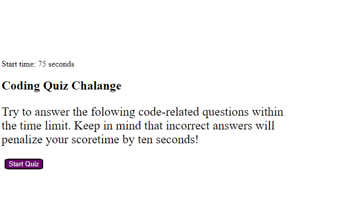

# Code quiz

## Description
This is a quiz to help study coding.  When the quiz starts a timer of 75 seconds starts, if you get a question wrong 10 seconds is deducted from the timer. When all questions are answered, your final score is your time left.  You are able to store your scores with initials to the leaderboard to compare scores.  

## Usage

https://cjtavares.github.io/code_quiz/

## License

MIT

